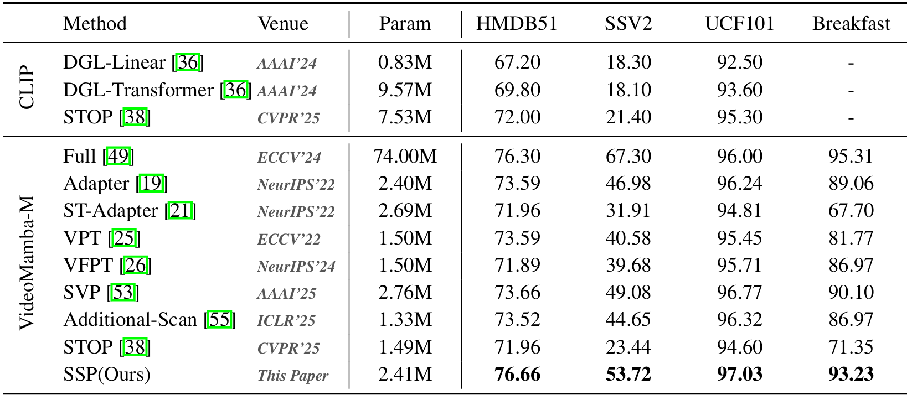

# [NeurIPS2025] State Space Prompting via Gathering and Spreading Spatio-Temporal Information for Video Understanding


<div>
      Jiahuan Zhou<sup>1</sup>&emsp; Kai Zhu<sup>1</sup>&emsp; Zhenyu Cui<sup>1</sup>&emsp; Zichen Liu<sup>1</sup>&emsp; Xu Zou<sup>2 *</sup>&emsp; Gang Hua<sup>3</sup>
  </div>
<div>

  <sup>1</sup>Wangxuan Institute of Computer Technology, Peking University&emsp;
  <sup>2</sup>School of Artificial Intelligence and Automation, Huazhong University of Science and Technology&emsp;
  <sup>3</sup>Amazon.com, Inc&emsp;

The *official* repository for  [State Space Prompting via Gathering and Spreading Spatio-Temporal Information for Video Understanding]().


### Environment

This code is based on pytorch 2.5.1, pytorch-cuda 11.8, and torchvision 0.20.1.

Please install causal_conv1d and mamba as follows:

```bash
cd causal-conv1d
pip install -e .
cd ..
cd mamba
pip install -e .
```

For a complete configuration environment, see requirements.txt.

### Data and Model Preparation

The something-something V2 dataset and the Breakfast dataset can be downloaded in [VideoMamba repo](https://github.com/OpenGVLab/VideoMamba/blob/main/videomamba/video_sm/DATASET.md). While the UCF101 dataset and the HMDB51 dataset can be accessed through [here](https://github.com/Emily0219/video-dataset-preprocess?tab=readme-ov-file).

The pre-trained model weights can be downloaded at [here](https://github.com/OpenGVLab/VideoMamba/blob/main/videomamba/video_sm/MODEL_ZOO.md).


### Quick Start

You can directly run the pre-written shell script:

```bash
chmod +x ./sh/SSV2.sh
./sh/SSV2.sh
```

### Results

The following results were obtained with four NVIDIA 4090 GPUs:



### Citation

If you find our paper and code useful in your research, please consider giving a star and citation. To do.

### Acknowledgement

Our code is partially based on the PyTorch implementation of [VideoMamba](https://github.com/OpenGVLab/VideoMamba/tree/main), and [AdaptFormer](https://github.com/ShoufaChen/AdaptFormer/tree/main). Thanks for their impressive works!

